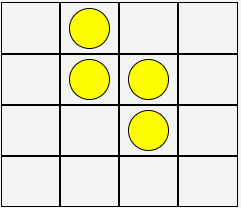

# Four Coin Puzzle Game

Consider 4 coins and a game board consisting of 4x4 cells. Initially, the coins are placed on the 4 cells in the center of the board as shown below:

The goal of the game is to move each coin to a corner cell. In a move, one of the coins must be moved either horizontally or vertically by 1, 2, or 3 cells. A coin can be moved if and only if all of the following conditions hold:

1. It is adjacent to one or more coins either horizontally or vertically.
2. The target cell is empty and all cells between the coin and the target cell are empty.

The solution to the puzzle that was provided by BFS:

1. [from=Move: (1, 1), to=Move: (0, 1)]

2. [from=Move: (2, 1), to=Move: (1, 1)]

3. [from=Move: (2, 2), to=Move: (2, 3)]

4. [from=Move: (1, 2), to=Move: (1, 3)]

5. [from=Move: (1, 1), to=Move: (1, 0)]

6. [from=Move: (1, 3), to=Move: (1, 1)]

7. [from=Move: (0, 1), to=Move: (0, 0)]

8. [from=Move: (1, 1), to=Move: (3, 1)]

9. [from=Move: (1, 0), to=Move: (3, 0)]

10. [from=Move: (3, 1), to=Move: (3, 3)]

11. [from=Move: (2, 3), to=Move: (0, 3)]

